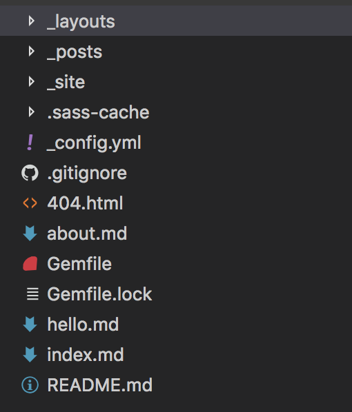

# Jekyll

## 安装方法
* 参考Jekyll主页 [Jekyll - Homepage](https://jekyllrb.com/)
* 通过Jekyll生成项目后，项目里的可以直接复制到github - docs或者githubpage里。
* 注意: 首先需要安装rvm, ruby。

## Jekyll生成的项目结构分析
* 项目结构图

1. .site，.sass-chase是编译是自动生成的文件夹，里面的内容用于正常显示网页。
1. 关于布局: 默认Jekyll项目中使用的布局是`minima`模板的，`minima`模板项目的路径为*Users/.rvm/gems/{当前系统使用的ruby版本}/gems/minima-2.1.1*